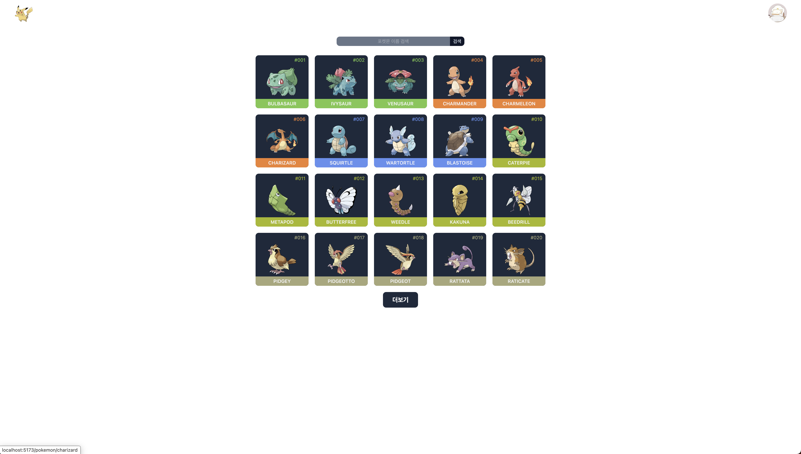
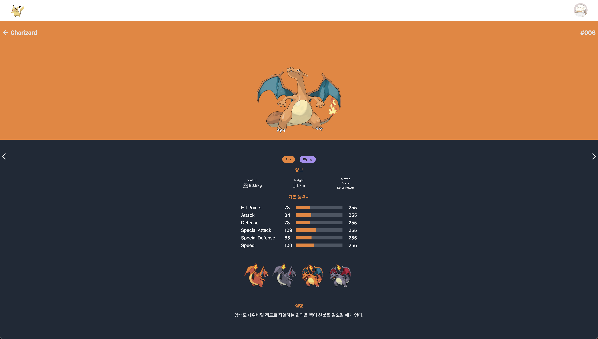
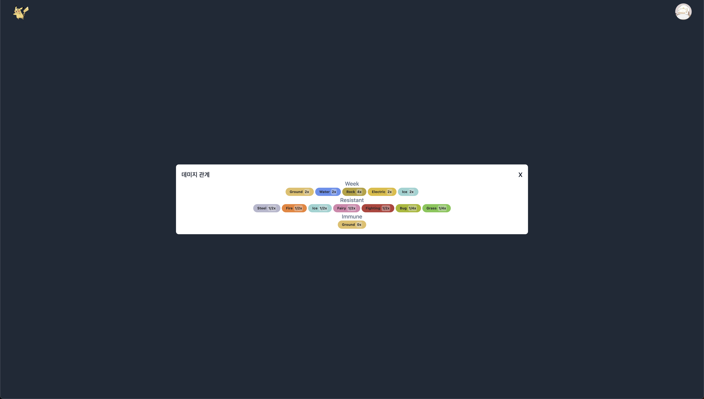
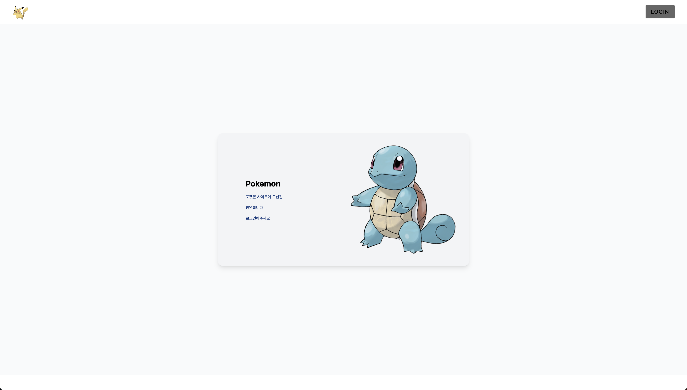

# Pokédex (포켓몬 도감)

이 프로젝트는 https://pokeapi.co/ 에 기재된 api 을 기반으로 구성한 프로젝트입니다.

프로젝트 구성 내용은 fastcampus 강의를 기반으로 clone coding 방식으로 작성하였으며, 세부적인 UI 의 경우 일부분 차이점이 있습니다.

### 설치 및 실행 방법

`npm install` 이후 `npm run dev` 을 통해 프로젝트 완성품을 간단히 살펴볼 수 있습니다.

### 구성

1. 메인 페이지
   - 포켓몬 목록을 불러올 수 있습니다.
     1. **검색** : 포켓몬 이름을 통해 검색할 수 있습니다. 또한 검색 과정에서 **자동완성** 기능이 활성화됩니다.
     2. **더보기** : **최대 1008 가지** 포켓몬 목록을 불러올 수 있습니다.
2. 세부 페이지
   - 포켓몬의 속성 및 데미지 계수와 스텟 등 **다양한 정보를 확인**할 수 있습니다.
   - **데미지 계수의 경우 포켓몬 이미지를 클릭함으로서 확인**이 가능합니다.
3. 로그인 페이지
   - 로그아웃 상태일 경우 보여지는 페이지입니다.
4. 메뉴바
   - **로그인 및 로그아웃**이 가능합니다.
   - **구글 로그인**을 사용했습니다.

### 스크린샷

1. 메인 페이지
   - 

         
     

2. 세부 페이지
   - 

           
     

   - 

          
     

3. 로그인 페이지
   - 

         
     

